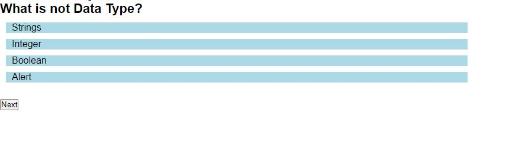

# simple_codequiz

##  JavaScript/HTML code quiz
My motivation behind creating this 8 questions code quiz app was to make students check their skills in JavaScript and html. It has timer set, and for every incorrect answer more time is deducted. It is simple to use and user can take this quiz as many times as they want. Finally, user can also get the highest score until now.

## Installation
Browser to open the link: https://nehaps29.github.io/simple_codequiz/

App/Questions looks like below picture:

## Credits
- W3schools: https://www.w3schools.com/css/default.asp
- MDN Web Docs: https://developer.mozilla.org/en-US/
- Rutgers TA 
- https://www.youtube.com/watch?v=PBcqGxrr9g8&ab_channel=GreatStack
- https://youtu.be/79WRPIknVHs

## License
Licensed under MIT